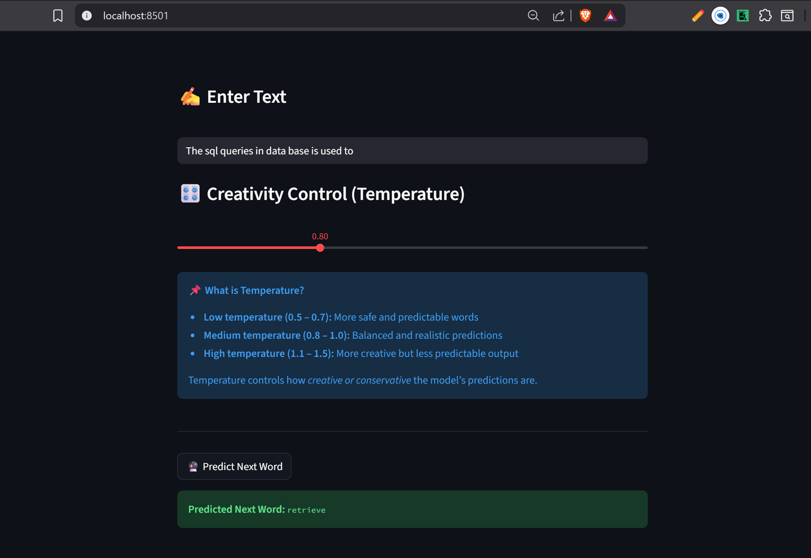

# 🧠 PixelWord – Context-Aware Next Word Prediction (NLP + LSTM)

PixelWord is an end-to-end NLP project that performs context-aware next-word prediction using a deep learning LSTM-based language model.  
The model is trained on 750k+ words extracted from books, learning sequential language patterns to predict the most probable next word given a text context.  
A live interactive web demo is built using Streamlit.

---

## 📌 Problem Overview (Brief)

Next-word prediction is a language modeling problem where the goal is to predict the most likely word that follows a given sequence of words.  
This task is fundamental to applications such as text autocompletion, chatbots, and language generation systems.

The key challenges include:
- Capturing long-range dependencies in text
- Handling a large vocabulary
- Producing meaningful predictions rather than random guesses

---



---

## 📊 Dataset

- **Source:** Publicly available books (PDF format)
- **Type:** Unstructured textual data
- **Total Words:** ~759,000
- **Unique Words:** ~29,000
- **Vocabulary Used:** Top 20,000 most frequent words

### Dataset Preparation
- Extracted raw text from PDFs
- Cleaned and normalized text
- Removed special characters and noise
- Tokenized text into word indices
- Generated fixed-length input sequences using a sliding window approach

---

## 🔍 Data Preprocessing

Key preprocessing steps included:
- Lowercasing all text
- Removing punctuation, numbers, and extra whitespace
- Tokenizing text using Keras Tokenizer
- Limiting vocabulary size to improve training stability
- Creating fixed-length sequences of 30 words to predict the next word

This approach ensured consistent input shape and efficient training on large text data.

---

## 🧠 Model Architecture

The final language model uses the following architecture:

- Embedding Layer (100 dimensions)
- LSTM Layer (128 units)
- Dropout Layer (0.2) for regularization
- Dense Softmax Output Layer (20,000-word vocabulary)

### Key Design Choices
- LSTM chosen for its ability to capture sequential dependencies
- Fixed-length context window (30 words) for stable learning
- Sparse categorical cross-entropy loss for efficient training

---

## 📈 Model Evaluation

### Metrics Used
- Training Loss
- Validation Loss
- Top-1 Accuracy (for reference)

### 🏆 Final Results
- **Validation Accuracy:** ~22%
- **Vocabulary Size:** 20,000 words
- **Key Insight:**  
  For large-vocabulary language models, accuracy is inherently low due to many valid next-word possibilities. Loss trends and qualitative predictions provide a more reliable evaluation.

---

## 🎛 Sampling Strategy (Prediction Quality)

To improve prediction quality and avoid repetitive outputs:
- Top-k sampling was applied
- Temperature scaling was used to control creativity

**Temperature Effects:**
- Low temperature → safer, more predictable words  
- Medium temperature → balanced predictions  
- High temperature → more creative but less stable outputs  

---

## 🛠 Tech Stack

### Machine Learning & NLP
- Python
- NumPy
- TensorFlow / Keras
- Scikit-learn

### Web Application
- Streamlit

---

## 🚀 Deployment Architecture

User (Browser)  
→ Streamlit Web Interface  
→ LSTM Language Model  
→ Predicted Next Word / Generated Text  

---

## ▶️ How to Run the Project Locally

### 1. Clone the Repository

```
git clone https://github.com/vijaysolanki9079/LexiNext.git
cd LexiNext
```
---

### 2. Create and Activate Virtual Environment

```
pip install -r requirements.txt
```

---

### 2. Create and Activate Virtual Environment

```
streamlit run app.py
```
UI URL:  
http://localhost:8501  


